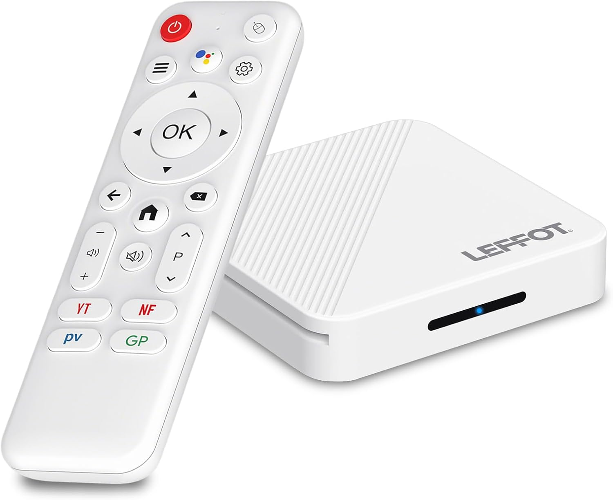

# Armbian for RK35xx TV boxes

Run Debian on a **$35 RK3518 Android TV box** that has no idea it's about to run Debian.

What you get for that money: a small, silent, fanless Armbian machine that arrives complete — case,
PSU, HDMI cable, and a remote that works over both IR and Bluetooth. No shopping list, no
enclosure-and-power-supply arithmetic.

Not a distro — a thin layer over the **stock Armbian image for the Radxa ROCK 2F** (same
RK3528-family kernel). One script bakes in what upstream can't know — the factory DDR bootloader, a
device tree, two DKMS drivers, a few boot fixups — and you flash the result to an SD card. Kernel
and userspace keep coming from Armbian via `apt upgrade`.

**Why not a proper Armbian build?** That means owning a kernel tree and merging upstream on time,
forever. Here everything that actually rots stays someone else's full-time job — and with the zoo of
near-identical TV boxes China ships every other week, per-board data is cheap to add where a
per-board kernel fork is not.

## Boxes

|            | **R69**                                     | **H96 Max** "H313"                             |
| ---------- | ------------------------------------------- | ---------------------------------------------- |
| Box        |  |  |
| Board      |   |   |
| Board key  | `r69`                                       | `h96max`                                       |
| SoC        | RK3518                                      | RK3518                                         |
| RAM        | 2 GB (1.5 GB usable)                        | 2 GB                                           |
| eMMC       | 16 GB Samsung                               | 16 GB Micron                                   |
| Wi-Fi / BT | AIC8800D80                                  | Seekwave SWT6621S                              |
| Details    | [board doc][r69]                            | [board doc][h96]                               |

[r69]: docs/r69/board.md
[h96]: docs/h96max/board.md

> **RK3518 is the budget bin of RK3528** — same 4×Cortex-A53, but rated to 1.4 GHz instead of 2.0, a
> Mali-450 GPU instead of Mali-G52, and 10/100 Ethernet instead of gigabit. Underneath it really is
> an RK3528: the R69's factory tree calls it `rockchip,rk3528a` outright, which is why the ROCK 2F
> image boots on it, and the H96 Max's says only `rockchip,rk3518` — a name no userspace knows, so
> that board carries a one-string graft ([why](docs/h96max/dtb.md)). Specs you read for RK3528 don't
> transfer, but the **video engine does**: both decode to 8K.

### Add yours

It's a generic **rk35xx TV box** builder that happens to ship two boards. **PRs welcome.**

A board is a `firmware/<board>/` directory, no code: `factory_idbloader.bin` and `board.dtb` (both
carved from its own eMMC), `payload.list`, `board.conf`. U-boot, DKMS drivers, first-boot setup and
the updater are shared.

**Base the DTB on the box's own Android tree**, with a handful of surgical edits for Armbian — it
already has every pin, clock and rail right for that board.

The fastest route: **hook up serial** (see below), point a coding agent — Claude Code, Codex,
whatever you use — at the existing `docs/*/worklog.md` bring-ups and let it walk the paved path.
Each one is written up in full, wrong turns included. A few hours, not a few weekends.

## What works

✅ works, verified · 🟢 likely works, unverified · 🟡 not tested · ❌ tested, doesn't work · ➖ not
present on this box

Measured throughput and thermals live in each board's doc. The video rows are a summary of a
per-format matrix; how to test yours is in [AGENTS.md](AGENTS.md#video-codec--every-format-both-directions).
Hardware H.264 **encoding** additionally needs a 12-line fix to Rockchip's MPP library, which ships
here with instructions: [mpp/](mpp/README.md).

| Feature                           | R69 | H96 Max |
| --------------------------------- | :-: | :-----: |
| Boot from SD                      | ✅  |   ✅    |
| Install to eMMC                   | ✅  |   ✅    |
| Ethernet 10/100                   | ✅  |   ✅    |
| Wi-Fi                             | ✅  |   ✅    |
| Bluetooth                         | ✅  |   ✅    |
| HDMI video                        | ✅  |   ✅    |
| HDMI audio                        | ✅  |   ✅    |
| HDMI-CEC                          | 🟢  |   🟢    |
| GPU (lima, OpenGL ES)             | ✅  |   ✅    |
| Video decode to 8K, hardware      | ✅  |   ✅    |
| Video encode to 8K, HEVC + MJPEG  | ✅  |   ✅    |
| Video encode, H.264 (needs patch) | ✅  |   ✅    |
| Serial console                    | ✅  |   ✅    |
| USB 2.0                           | ✅  |   ✅    |
| USB 3.0                           | 🟢  |   🟢    |
| SD card slot                      | ✅  |   ✅    |
| Temperature sensor                | ✅  |   ✅    |
| LEDs                              | ✅  |   ✅    |
| IR remote                         | ✅  |   ✅    |
| Remote over Bluetooth (air-mouse) | ✅  |   ✅    |
| Remote voice mic (app territory)  | 🟡  |   🟡    |
| Toothpick button                  | ✅  |   ✅    |
| Power button                      | ✅  |   ✅    |
| Suspend-to-RAM                    | ✅  |   ✅    |
| Wake from off / suspend by remote | ✅  |   ✅    |
| Wake-on-LAN                       | 🟡  |   🟡    |
| AV jack audio                     | 🟡  |   🟡    |
| AV jack composite video           | 🟡  |   🟡    |
| IR-extender jack                  | 🟡  |   ➖    |
| CPU deep idle                     | ❌  |   ❌    |
| Hardware watchdog                 | ✅  |   ✅    |

## Build

Needs a **microSD** (8 GB+) and a stock **[Armbian ROCK 2F](https://www.armbian.com/rock-2f/)**
`.img.xz` — tested against the `minimal` vendor 6.1 build.

```bash
brew install e2tools xz coreutils            # macOS  ·  apt install e2tools xz-utils on Debian
./build-image.sh Armbian_..._Rock-2f_..._minimal.img.xz h96max      # board: r69 | h96max
```

~1 minute, no Docker, no kernel build. Output: `Armbian_..._-<board>.img`.

## Flash and boot

```bash
diskutil list                            # macOS — find the card   ·   lsblk on Linux
diskutil unmountDisk /dev/diskN
sudo gdd if=Armbian_..._-h96max.img of=/dev/rdiskN bs=4M conv=fsync status=progress; sync   # macOS
sudo dd  if=Armbian_..._-h96max.img of=/dev/sdX    bs=4M conv=fsync status=progress; sync   # Linux
```

…or [Balena Etcher](https://etcher.balena.io/). Insert the card and power on.

> **First boot takes a few minutes** — it compiles and installs the IR and Ethernet-PHY kernel
> modules offline before the box settles. It won't answer on the network until that's done, so give
> it ~5 minutes before assuming anything is wrong. If it never shows up, that's what the
> [serial console](#serial-console) is for: a 3.3 V USB-TTL adapter and three micro test-clamps on
> GND/RX/TX will show you exactly where it stopped.

```bash
ssh root@<box-ip>        # Armbian default password for root is 1234
```

Stock Android is untouched — **eject the SD and Android boots again.**

> **A side benefit.** Cheap Android TV boxes — the export-only kind, often stamped "not for sale in
> China" — have a documented history of shipping with preinstalled malware and backdoors (the BADBOX
> family being the famous case). Booting Armbian replaces that userspace wholesale. Note the
> asymmetry, though: running from SD leaves the Android image sitting dormant on the eMMC, while
> [installing to eMMC](#install-to-emmc) overwrites it for good.

## Install to eMMC

Faster than any SD card. **Wipes factory Android, which can't be re-dumped afterwards** — back it up
first; that image is your only road back.

```sh
lsblk                                        # the eMMC is the disk with mmcblkXboot0/boot1 beside it
sudo dd if=/dev/mmcblkX bs=4M status=progress | ssh you@host 'cat > emmc-stock.img'   # or dd to a file
sudo armbian-install                         # choose "Boot from eMMC / system on eMMC"
sudo poweroff                                # pull the SD; it boots from eMMC
```

Restoring is the same `dd` in reverse, from an Armbian SD.

> **Never trust remembered device names.** `mmcblk` numbering shifts between images and boots — on
> one of our builds the eMMC was `mmcblk1`, on the next `mmcblk2`. Identify it every time: the eMMC
> is the ~16 GB disk that has **`boot0`/`boot1` companions**, which SD cards never have.

> **Sector 64 is sacred** — it holds your DRAM die's DDR tuning. Our images make `armbian-install`
> write the right loaders; on images older than August 2026, update first
> ([#6](https://github.com/sormy/rk35xx-tvbox-armbian/issues/6)).

## Update a running box

For changes in **this repo** — DTB, drivers, scripts. Everything else: `apt upgrade`.

```bash
./rk35xx-deploy root@<box-ip>     # push this repo and apply  (--reboot if the DTB changed)
sudo rk35xx-update --pull         # …or on the box, fetching the repo itself
```

Detects the board, installs the payload, rebuilds DKMS, reinstalls the DTB, restarts what changed —
rebooting only if `board.dtb` did, never touching the bootloader. On the R69, `r69-update` /
`r69-deploy` still work.

> Updating **overwrites the files it ships**, so local edits to them (e.g. switching
> `HandlePowerKey` to suspend) are reverted. Keep customisations elsewhere, or re-apply after an
> update.

## Remote

IR works unpaired; Bluetooth adds air-mouse and battery. Keycodes differ between the two, and
between boxes — the board docs list ours, but check your own:

```sh
cat /proc/bus/input/devices    # IR = ffa90030.pwm  ·  BLE = "Bluetooth remote …"
sudo evtest /dev/input/eventN  # press buttons, read keycodes  (apt install evtest)
```

To pair it: **hold left + right on the remote until its LED blinks** (that's pairing mode), then
scan and look for the entry named **`Bluetooth remote`**:

```sh
sudo apt install bluez            # minimal images ship without it

# 1. remote in pairing mode (LED blinking), then find it by name:
MAC=$(bluetoothctl --timeout 20 scan on | grep -im1 "bluetooth remote" \
      | grep -oE '([0-9A-F]{2}:){5}[0-9A-F]{2}')
echo "found: $MAC"

# 2. put it back in pairing mode, then pair in ONE session with the scan running:
{ echo "agent NoInputNoOutput"; sleep 1; echo "default-agent"; sleep 1; echo "scan on"; sleep 8
  echo "pair $MAC";  sleep 20; echo "trust $MAC"; sleep 2
  echo "connect $MAC"; sleep 8;  echo quit; } | bluetoothctl
```

It has to be **one session with a scan running** — `pair` from a separate invocation fails with
`org.bluez.Error.AuthenticationFailed`, and so does `--agent` on its own. To undo it:
`bluetoothctl remove $MAC` drops the bond (the remote then falls back to IR), while
`bluetoothctl disconnect $MAC` just parks it for this session.

> Dead IR? Your remote's usercode isn't in the DTB's scancode tables. Boxes sold under the same
> model name often ship different remotes, so don't assume the tables here cover yours.

## Serial console

**Set this up first** — it's the only view of U-Boot, early boot, and any hang before the network
exists. RK35xx boxes run their debug UART at **1500000 baud**.

Both cases open with a plastic pry tool (phone-repair triangle); clips only, nothing glued. On the
H96 Max a couple of screws free the PCB to reach the pads from the back.

| Board       | Where                                       | Pinout, `[square pad]` first |
| ----------- | ------------------------------------------- | ---------------------------- |
| **R69**     | 4-pad header beside the SD slot             | **[GND] · TX · RX · 3V3**    |
| **H96 Max** | 3 plated holes between the SD slot and LEDs | **[RX] · GND · TX**          |

Both boards are photographed above with the header marked.

- **Adapter:** 3.3 V USB-TTL that does 1.5 Mbaud — **FT232 or CH340**, e.g.
  [Waveshare FT232RNL](https://www.amazon.com/dp/B0CX55K4RG) (~$14).
- **Wiring:** GND, TX, RX only, crossed (box TX → adapter RX, box RX ← adapter TX). **Never connect
  3V3/VCC** — the box is self-powered; tying rails can backfeed.
- **Contact:** no soldering — [test-hook grabbers](https://www.amazon.com/dp/B07BCZSNGS) (~$10) grip
  the pads.

**On an unknown box** — every one of these has a header somewhere, usually a group of 3–4 pins near
the SD slot or the SoC, with only one or two candidate groups on the whole board. Pins are often
tiny, which is what the grabbers are for.

- **4 pins = GND · TX · RX · 3V3**, **3 pins = GND · TX · RX**. Order can vary.
- **Find GND first:** with the box powered, measure each pin against exposed metal (USB shell, SD
  cage, Ethernet jack) — GND reads 0 V. Of the rest, **3V3 reads highest** and TX/RX sit a few mV
  below it.
- **TX vs RX is a coin flip** — right half the time, certain by the second try, and swapping them
  damages nothing. Remember they cross: box TX → adapter RX.
- After a wrong guess, **unplug and replug the adapter** before judging the next attempt; it often
  needs the reset.

```bash
brew install tio                                              # or: apt install tio
tio -b 1500000 -L --log-file boot.log /dev/cu.usbserial-XXXX  # macOS: cu.*, not tty.*
tio -b 1500000 -L --log-file boot.log /dev/ttyUSB0            # Linux
```

Power-cycle and the log scrolls. You get a login prompt, and U-Boot's countdown is interruptible.

> **A CP2102 will betray you** — it tops out short of 1.5 Mbaud and renders the boot log as
> confident, well-formatted noise. Garbage on screen? Suspect the adapter first.

Output but no input → recheck contact and the TX↔RX crossing. Full kernel log on serial and HDMI →
set `verbosity=7` in `/boot/armbianEnv.txt`.

## Credits

Original RK3518 bring-up method by
**[juliovendramini/rk3518_armbian](https://github.com/juliovendramini/rk3518_armbian)**.

Scripts MIT · device trees GPL-2.0+/MIT (derived from Rockchip DTs) · `factory_idbloader.bin` and
`u-boot.itb` are Rockchip/U-Boot/ATF blobs under their own licenses.
