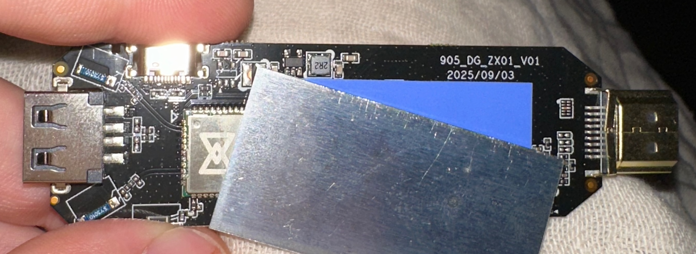

# H96 Max M20

Board id `h96max-m20`, provisional — the box's own strings say `S905LTS` on platform `p291`.
Measured on one unit; these numbers are per-unit and they decay. The full factory evidence sweep is
`stock/h96max-m20/README.md`.

**In bring-up.** Armbian boots from a USB stick unattended and runs from it; eMMC, USB, Ethernet
(via a USB adapter) and the power LED work. Nothing is installed to eMMC. Known gaps are at the
bottom.

## Identity

| Property    | Value                                                                  |
| ----------- | ---------------------------------------------------------------------- |
| SoC         | Amlogic S905L3 — GXLX2, `p291` reference board, RevE                   |
| CPU         | 4× Cortex-A53, 1200 MHz                                                |
| RAM         | 2 GB LPDDR3, rank0+1 @ 600 MHz                                         |
| eMMC        | SanDisk `DF4016`, 30777344 sectors = 15.76 GB                          |
| Wi-Fi / BT  | MediaTek MT7668 on SDIO, func1 Wi-Fi and func2 Bluetooth               |
| Ethernet    | ➖ no connector fitted; the SoC MAC block binds anyway                 |
| USB         | 2.0 only; USB-C is OTG, USB-A host-only                                |
| Front panel | one blue LED, lit at power on; one button; ❓ no IR receiver confirmed |
| Serial      | 115200 on three pads centre-back: HDMI <- TX GND [RX]                  |
| PCB marking | `905_DG_ZX01_V01`, date code `2025/09/03`                              |



## Addresses

| Interface | Address             | Where it comes from                             |
| --------- | ------------------- | ----------------------------------------------- |
| eth0      | `62:b4:4d:3b:72:e6` | the unifykey `mac` slot — stored, readable      |
| wlan0     | `d0:aa:5f:32:eb:f2` | the chip's own eFUSE, read through the firmware |
| bdaddr    | `D0:AA:5F:32:EB:F3` | the chip's own, one above its eFUSE             |

`mac_wifi` and `mac_bt` read `exist=none`, so there is no fused value to recover for those two.

## Measured on Armbian

Kernel 6.18.44, image of 2026-09-17. `fio --direct=1`, `iperf3` to a wired host.

| Measure                     | Value                                      |
| --------------------------- | ------------------------------------------ |
| Boot to `graphical.target`  | 16.18 s (6.11 kernel + 10.07 userspace) ✅ |
| RAM                         | 1954 MB ✅                                 |
| eMMC sequential read        | 43.3 MiB/s ✅                              |
| eMMC sequential write       | 32.7 MiB/s ✅                              |
| eMMC random 4K read         | 2711 IOPS, 10.6 MiB/s ✅                   |
| eMMC random 4K write        | 3839 IOPS, 15.0 MiB/s ✅                   |
| USB stick (rootfs) read     | 21.2 MiB/s ✅                              |
| USB stick (rootfs) write    | 20.8 MiB/s ✅                              |
| USB throughput (via Gb NIC) | 196 Mbit/s, idle and under 4-core load ✅  |
| `stress-ng` 4×cpu + 2×vm    | 120 s `--verify`, 6 passed, 0 failed ✅    |
| Watchdog                    | `/dev/watchdog0`, Meson GXBB, 30 s ✅      |

The eMMC write figures were taken in the last 128 MiB, outside the factory partitions, and the
region was saved and restored byte-identical afterwards.

**The Ethernet number is a USB measurement.** No Ethernet is fitted, so it is a USB-attached RTL8153
on a USB 2.0 host that is also serving the rootfs — 196 Mbit/s is the bus, not the NIC.

There is no `cpufreq` and there are no thermal zones, so no frequency or temperature figure can be
taken; the four `thermal` lines in `dmesg` are governor registrations, not throttling.

## eMMC over the OTG port

`amlcmd` drives the burning gadget; `src/amlcmd/README.md` is the procedure.

| Measure          | Value                                 |
| ---------------- | ------------------------------------- |
| read             | 12.4 MiB/s, 256 MiB in 20.6 s ✅      |
| write            | 9.3 MiB/s, 256 MiB in 27.4 s ✅       |
| full backup      | 15758000128 bytes in about 25 min ✅  |
| 256 MiB verified | written back and re-read identical ✅ |

The rate is set by the gadget, not the host: one control round trip per 64 KiB slot and an endpoint
re-arm every 4 KiB from U-Boot's polling loop. A C client and a Python one measured within 2% of
each other on the same range.

Sectors 73760–74271 are the key window inside `reserved`; a whole-device pass needs
`store disprotect key` in front of it or it stops there.

## Building an image

```bash
brew install xz coreutils mtools u-boot-tools   # macOS  ·  apt install xz-utils mtools u-boot-tools
./build-e2tools.sh                              # once — stock e2tools corrupts an image on delete
./build-image.sh Armbian_..._Lepotato_..._minimal.img.xz h96max-m20
```

The base is Armbian Le Potato, and the build refuses any other image. Output is two partitions: a
512 MiB FAT32 holding `aml_autoscript`, `u-boot.ext` and `boot.scr`, then the Armbian rootfs. The
eMMC is untouched — Android still boots with the stick out.

## Booting it

Write the image to a USB stick and plug it into the USB-A port. The **first** boot needs the
environment pointed at the stick once: over the OTG cable with `amlcmd`, the recipe in
`README_AMLOGIC.md`, or at the serial prompt. A cold boot runs `try_auto_burn`, whose USB gadget
makes `usb start` hang, so over serial warm-reboot first:

```
reboot normal
usb start 0
run recovery_from_udisk
```

On the first stick boot `aml_autoscript` rewrites the factory environment — clearing `try_auto_burn`
and pointing `bootcmd` at the stick, with `run storeboot` as the fallback — so **every later
power-on boots the stick with no serial at all**. Pull the stick and the box boots Android as
before; the button's burning-mode path is untouched.

| Step             | What runs                                              |
| ---------------- | ------------------------------------------------------ |
| `aml_autoscript` | chain-loads the base image's U-Boot 2024.01 with `go`  |
| `boot.scr`       | loads kernel, initrd and our tree off ext4 at 43 MiB/s |

The chain-load exists because U-Boot 2015 computes a modern arm64 kernel's load address as 0 and
aborts on the memmove — `booti` fails whatever address the kernel is loaded at.

## Wireless

Mainline mt76 is the driver: `patches/mt76-mt7668/`, built as DKMS and loaded at boot, with
`btmtksdio` beside it. MediaTek's own driver is the fallback and is not shipped;
`patches/mt76x8-mt7668/README.md` builds it. Only one may claim the part, so running the fallback
means blacklisting `mt7663s` in `/etc/modprobe.d/`.

Swapping drivers needs no reboot. Unload the running one while it still holds the card, then cycle
the sdio host so the next one finds a powered-down part. On the box:

    rmmod wlan_mt76x8_sdio        # or: rmmod mt7663s
    echo d0070000.sdio > /sys/bus/platform/drivers/meson-gx-mmc/unbind
    echo d0070000.sdio > /sys/bus/platform/drivers/meson-gx-mmc/bind
    modprobe mt7663s              # or: modprobe wlan_mt76x8_sdio

### Both drivers, measured 2026-09-25

`iperf3` against a wired host on the LAN, wlan0 given its own address and routing table so the
traffic cannot leave over Ethernet. Two 10 s runs per TCP direction, 30 s both ways, 20 idle pings.
Throughput in Mbit/s; the access point runs channel 40 at 80 MHz and channel 6 at 20 MHz.

| Driver | Domain | Band    | TCP up     | TCP down   | UDP up/down | Both ways | Idle ping |
| ------ | ------ | ------- | ---------- | ---------- | ----------- | --------- | --------- |
| mt76   | US     | 5 GHz   | 142, 151   | 142, 143   | 160 / 152   | 111 + 42  | 7.9 ms    |
| mt76   | none   | 5 GHz   | 141, 151   | 143, 144   | 160 / 150   | 110 + 44  | 9.0 ms    |
| vendor | US     | 5 GHz   | 150, 151   | 91, 150    | 163 / 162   | 114 + 40  | 8.7 ms    |
| vendor | none   | 5 GHz   | 148, 151   | 150, 151   | 162 / 162   | 103 + 52  | 8.9 ms    |
| mt76   | US     | 2.4 GHz | 91.9, 88.7 | 90.1, 89.9 | 102 / 92    | 43 + 52   | 15.1 ms   |
| mt76   | none   | 2.4 GHz | 92.4, 91.2 | 89.2, 89.9 | 101 / 93    | 50 + 45   | 9.1 ms    |
| vendor | US     | 2.4 GHz | 92.4, 93.5 | 86.5, 90.8 | 97 / 91     | 58 + 31   | 9.2 ms    |
| vendor | none   | 2.4 GHz | 91.5, 92.4 | 91.0, 90.4 | 100 / 94    | 75 + 18   | 11.3 ms   |

The mt76 rows predate the current build, whose 5 GHz download measures 150-151 over six runs of
three.

**The regulatory domain changes nothing measured here.** With none set, mt76 adopts `US` from the
access point's country element on joining, and the vendor registers self-managed wiphys with its own
domain; both associate on 5 GHz either way. `country 00` leaves 28 channels no-IR here against 3
under `US`.

A first download after a reload sometimes runs at about 90, under both drivers; the next is back to
full rate.

mt76 reconnects without a reload in 105-352 ms, 40 of 40. Joins from a reload complete in 3-4 s.

Under `stress-ng --cpu 4` the vendor driver measured 88 up and 90 down on 2.4 GHz, 144 and 139 on 5
GHz (2026-09-20), and returned to baseline on the first measurement after the load stopped.

**A stock `wpa_supplicant` conf may pin the band.** The one here carries `scan_freq=2437` and a 2.4
GHz-only `freq_list`, which makes wpa_supplicant reject every 5 GHz BSS with
`skip - frequency not allowed`. A configuration limit, not the part's.

`hci0` is `D0:AA:5F:32:EB:F3`, this unit's own, identical across three reboots.

mt76 reads `wlan0`'s address from the eFUSE through the firmware: the unit's own, one below the
Bluetooth one.

Under the vendor driver it depends on one key in `wifi.cfg`: at the factory's `EfuseBufferModeCal 1`
it is `00:0c:43:26:60:48`, the calibration blob's, the same on every board that installs the file;
at `EfuseBufferModeCal 0` it is the chip's own but the calibration is measurably weaker. Both bands
associate either way. Vendor driver, same access point and position, `iperf3` TX in Mbit/s
(2026-09-20):

| Calibration                  | `wlan0`             | 2.4 GHz        | 5 GHz    |
| ---------------------------- | ------------------- | -------------- | -------- |
| the blob                     | `00:0c:43:26:60:48` | 90, 92, 92     | 154      |
| the chip                     | `d0:aa:5f:32:eb:f2` | 57, 77, 77     | 126, 129 |
| the blob, MAC bytes replaced | `d0:aa:5f:32:eb:f2` | 89, 89, 94, 97 | 132-141  |

## Installing to eMMC

❓ Single boot, as CoreELEC installs: Android and `cache` go, the vendor bootloader stays and
chain-loads the image's own U-Boot. `build-image.sh` rewrites the factory MPT and both DTB copies in
`reserved` to this layout; `scripts/aml-emmc-install` writes it over the OTG cable.

| Sectors       | Holds                                           |
| ------------- | ----------------------------------------------- |
| 0–8191        | vendor bootloader — never written               |
| 8192–16383    | the image's U-Boot, read by `amlmmc` from `env` |
| 16384–73727   | FAT: `boot.scr`, `aml_autoscript`               |
| 73728–204799  | `reserved`: MPT, keys (never written), DTB × 2  |
| 237568–253951 | `env`: `bootcmd` loads the image's U-Boot       |
| 253952–end    | the ext4 rootfs                                 |

## Known gaps

| Item                 | State                                                            |
| -------------------- | ---------------------------------------------------------------- |
| Wi-Fi, mainline mt76 | ✅ both bands — its gaps in `patches/mt76-mt7668/README.md`      |
| Wi-Fi, vendor driver | ✅ both bands, the fallback — numbers above                      |
| Bluetooth            | ✅ `btmgmt find` discovers devices — needs the `btmtksdio` quirk |
| cpufreq              | ❌ no scaling: the tree has no `operating-points-v2`             |
| Thermal              | ❌ no zones: the vendor tree models the sensor its own way       |
| VPU power domain     | ❌ `meson_ee_pwrc` wants resets and clocks the vendor node lacks |
| GPU                  | ❌ `lima` cannot get its bus clock                               |
| CMA                  | ❌ the reserved-memory region fails to set up                    |
| HDMI, audio, video   | ❓ never exercised                                               |
| SD slot              | ➖ not fitted; the SD host registers with nothing behind it      |
| Button               | ❓ the ADC registers; the key mapping is untested                |
| Standby LED          | ➖ not fitted on this unit; the node is kept, active low         |
| Install to eMMC      | ❓ the single-boot image verifies offline; never flashed         |
| Hang under a build   | ❓ stopped answering twice during a module build; cause unknown  |
| Network drop         | ❓ once, after a driver reload, minutes without ping; no reboot  |
| mt76 at boot         | ❓ loads by name; autoload at boot never run                     |
| Fresh image          | ❓ rebuilt with the trimmed payload; not booted since            |
| DRAM from the ROM    | ❌ writes fail; the mask ROM serves SRAM only                    |
| Unbrick via the ROM  | ❓ needs a USB-boot BL2; this board's ACS is format v3           |
